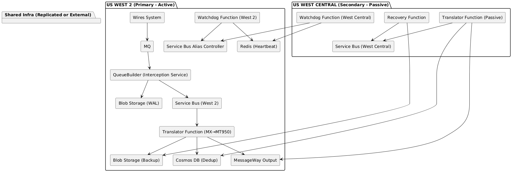
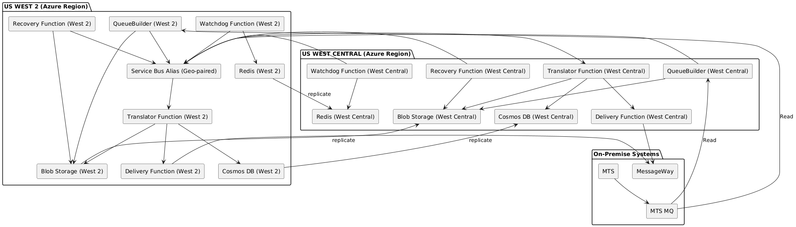
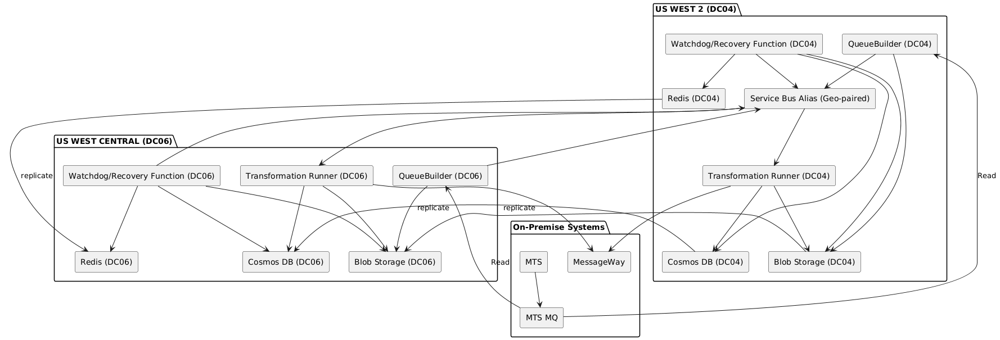

# Enhanced HA/DR Design Plan for Zero Data Loss and Seamless Failover

## 1. Minimize Data Loss & Duplication to Near-Zero

### A. Durable Write-Ahead Log (WAL) Before Service Bus

- **What**: Write each message to Blob or Cosmos DB before sending to Service Bus.
- **Why**: Ensures messages are recoverable if QueueBuilder crashes after MQ read but before SB write.

### B. Idempotent Processing with UUID Tracking

- **What**: Use a unique message ID (`messageId`) for every message.
- **How**: Store each ID in Cosmos DB or Redis. Check before processing in the Function.
- **Why**: Prevents duplicate execution across restarts or failover.

### C. Exactly-Once Delivery with Cosmos DB Transactions

- Wrap Function logic with a "check + process + mark" flow.
- Cosmos DB or Redis Streams can manage the status of processed messages.
- Retry logic respects processed status.

### D. Blob Backup Replayer

- Store a copy of every message in Blob (write-ahead).
- Use a Recovery Processor (Azure Function) that replays from Blob using checkpointing.


## 2. Automate and Seamlessly Coordinate Switchover

### A. Redis Heartbeat with TTL + Lease Lock

- `active_dc` key with a short TTL (e.g. 30s)
- Each component checks and renews the lease only if no other region is active.
- Use Redis `SET key value NX PX` for atomic locking.

### B. Automate Service Bus Alias Failover

- Use Azure CLI or ARM scripts to reassign SB alias to secondary.
- Trigger from Azure Monitor alerts or a Watchdog Function.

```bash
az servicebus georecovery-alias set \
  --resource-group myRG \
  --namespace-name primaryNS \
  --alias myAlias \
  --partner-namespace secondaryNS
```

### C. Global Orchestrator (Watchdog) Function

- Monitors:
  - Region health
  - Function health
  - Redis heartbeat validity
- Takes action:
  - Switches `active_dc` flag
  - Triggers SB alias failover
  - Sends alerts

### D. Staging Queue Pattern

- QueueBuilder writes first to a staging queue.
- Function acknowledges success before moving message to main queue.
- Adds buffering and confirmed handoff during transition states.


## Optional Enhancements

| Feature                     | Description                                                  |
|-----------------------------|--------------------------------------------------------------|
| Azure Chaos Studio          | Simulate failover scenarios safely                          |
| API Management Layer        | Apply retry, throttling, or deduplication logic centrally    |
| Zone-Redundant Function App | Survive intra-region zone failures                          |
| Cosmos DB TTL               | Auto-clean deduplication records after TTL (e.g., 7 days)    |


## Summary of Additions

| Goal                   | Additions                                                      |
|------------------------|----------------------------------------------------------------|
| Zero Data Loss         | WAL to Blob/Cosmos, Replayable Backup, Durable Write           |
| No Duplicates          | Idempotency via Message ID, Cosmos/Redis dedupe store          |
| Seamless Switchover    | Redis TTL & Lease Lock + SB Alias Failover + Watchdog Function |
| Fast Replay/Recovery   | Blob Replayer with Checkpointing                               |


## Enhanced Design Diagram

<!--img src="img/mxmt-dr-enh.png" alt="DR Scenario" width="450"/-->

### v2



### v3



### v4

