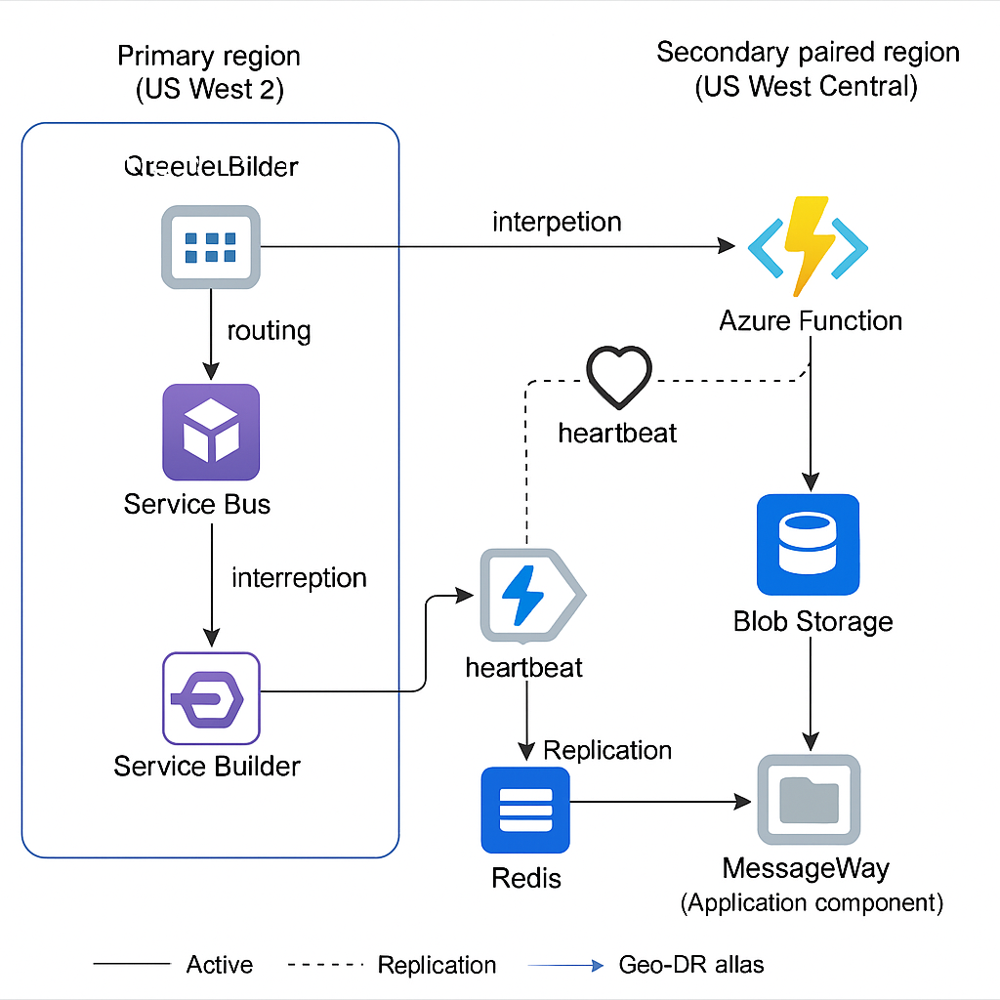

# MX/MT DR Design

## Context & Requirements

| **Requirement**                   | **Constraint**                             |
|-----------------------------------|--------------------------------------------|
| RTO                               | ≤12 hours                                  |
| RPO                               | <4 hours                                   |
| Data Loss                         | Zero tolerance                             |
| Duplicates                        | Must be avoided                            |
| Ordered Delivery                  | Must be preserved                          |
| Active/Passive preferred          | Yes – true active/active not required      |
| Active DC coordination method     | Redis-based heartbeat (replicated)         |
| Each component will check         | If current region is active before processing |

## Service Bus Geo-DR + Durable Functions + Blob Backup

### 🔹 Architecture Overview

- **Single Service Bus namespace (Geo-paired)**:  
  US West 2 (Primary), US West Central (Secondary)
- **Azure Service Bus alias abstracts failover**
- **QueueBuilder writes to primary SB namespace**
- **Azure Function uses SB Trigger with checkpointing**
- **Functions write to downstream folder/MQ**
- **A Blob-based backup log stores message copy before processing**
- **Redis heartbeat flag ensures only active DC processes**

### ✅ Pros

| **Benefit**                        | **Details**                                                    |
|-----------------------------------|----------------------------------------------------------------|
| ✅ Simpler message routing         | Only 1 active queue and SB namespace to write to              |
| ✅ No duplicates                   | Only 1 queue is active, and only 1 function runner is enabled |
| ✅ Ordered delivery                | Preserved naturally with Service Bus FIFO support             |
| ✅ SB alias makes failover seamless| Can be scripted or manually swapped                           |
| ✅ Redis heartbeat enforces region role | Blocks queue processor in passive region                  |
| ✅ Blob backup adds resilience     | In case SB or Function fails                                   |

### ❌ Cons

| **Limitation**                       | **Details**                                                        |
|-------------------------------------|---------------------------------------------------------------------|
| ❌ SB Geo-DR is active/passive only  | Secondary namespace can’t be written to unless failover is triggered |
| ❌ Failover requires manual/scripting| Alias failover not automatic unless you script it                  |
| ❌ Processing halted during failover transition | Redis can help smooth this, but there will be a gap       |
| ❌ Blob backup must be pruned or aged| Or risk cost/complexity over time                                  |

## Advantages

- Simpler architecture aligned with active/passive model  
- Avoids deduplication logic and complex dual write issues  
- Service Bus maintains order, and Geo-DR handles namespace failover cleanly  
- Blob backup gives you a safety net for RPO without major complexity  
- Redis heartbeat gates all function execution to prevent duplicates

---

## DR Diagram

---

## Scenario Matrix

| **Failure Scenario**                                      | **What Happens**                                                                | **Mitigation/Failover Mechanism**                                                                                   | **RPO Met (<4h)?** | **RTO Met (≤12h)?** | **Data Loss?**                                         | **Duplicates?**                  | **Notes**                                         |
|-----------------------------------------------------------|----------------------------------------------------------------------------------|----------------------------------------------------------------------------------------------------------------------|--------------------|----------------------|--------------------------------------------------------|----------------------------------|--------------------------------------------------|
| 1. Primary Azure Region Outage (US West 2)                | QueueBuilder, Service Bus, and Functions in US West 2 go down                    | - SB alias manually or automatically repointed to secondary - Redis heartbeat switches role to West Central      | ✅                  | ✅                    | ❌ if SB messages not replicated, but ✅ if Blob used    | ❌ (only secondary runs)          | SB Geo-DR alias key here                         |
| 2. Azure Function Failure (only)                          | Messages are not processed from SB                                              | Function restarts automatically or can be redeployed; Redis prevents secondary from running                         | ✅                  | ✅                    | ✅                                                      | ✅                                | Function apps must poll Redis for heartbeat       |
| 3. Service Bus Corruption / Message Poisoning             | One or more messages lost or dead-lettered                                      | Blob backup used to requeue messages; optionally read blob and post to SB again                                    | ✅                  | ✅                    | ✅ if blob used for every message                      | ✅ if deduped before retry         | Add DLQ alerting & blob replay logic              |
| 4. Transient Network Loss Between MQ and QueueBuilder     | QueueBuilder can’t read new messages                                            | Retry logic with exponential backoff; no new messages processed until reconnection                                 | ✅                  | ✅                    | ✅                                                      | ✅                                | Add retry logic + logging for dropped reads       |
| 5. Transient Loss Between QueueBuilder and Service Bus    | Messages not posted to SB                                                       | Retry logic; messages also stored in Blob if write attempt failed                                                  | ✅                  | ✅                    | ✅                                                      | ✅                                | Consider a durable queue for transient buffering  |
| 6. Redis Failure or Desync                                | Region may not know which is active                                             | Redis in-memory persists + geo-replication fallback Components block processing if Redis unavailable            | ✅ (processing paused) | ✅                    | ✅                                                      | ✅                                | Redis must be highly available with TTL fallback  |
| 7. Blob Storage Failure (read or write)                   | No backup log written or available                                              | Service Bus retains messages until processed; retry blob writes after error                                        | ✅                  | ✅                    | ❌ for blob recovery, but ✅ overall due to SB         | ✅                                | Blob is supplemental protection                   |
| 8. MessageWay (Final Destination) Unavailable             | Messages cannot be delivered                                                    | Message remains in function’s retry queue; alerts trigger; optionally write to secondary location                  | ✅                  | ✅                    | ✅                                                      | ✅                                | Consider secondary drop location or DLQ           |
| 9. Function Processes Same Message Twice (due to restart) | Potential duplicate                                                             | Use transaction ID or message ID stored in Cosmos DB or cache (idempotency store) to deduplicate                   | ✅                  | ✅                    | ✅                                                      | ❌ unless deduping enforced        | Deduplication logic required downstream           |
| 10. Manual SB Alias Switch Delay or Misrouting            | Wrong region processes or no region active                                      | Redis heartbeat prevents dual-processing; alias monitored by operations                                            | ✅                  | ✅                    | ✅                                                      | ✅                                | Automation helps — can script SB failover alias   |
