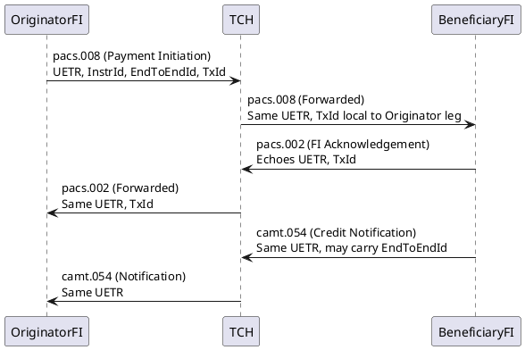

# RTP Transaction Lifecycle (Simplified)

We will assume a simple case:

- Originator FI sends RTP payment (pacs.008)  
- TCH RTP network routes it  
- Beneficiary FI receives and responds (pacs.002), then credits customer  
- Notifications (camt.054) flow back for posting/statementing  

---

## 1. Sequence Diagram (PlantUML)

**Key takeaway:** UETR stays constant everywhere. TxId is only stable within each bilateral leg. InstrId is local. EndToEndId is usually stable, but can vary in returns/repairs.

---

## 2. Example Table of IDs in One RTP Transaction

| Message          | Phase (Plain English)              | UETR (36 chars UUID)                          | EndToEndId (≤35 chars, customer ref) | InstrId (≤35 chars, FI ref) | TxId (≤35 chars, FI-to-FI ref) |
|------------------|------------------------------------|-----------------------------------------------|--------------------------------------|-----------------------------|--------------------------------|
| pacs.008         | Originator FI sends payment to TCH | 123e4567-e89b-12d3-a456-426655440000 (36)      | INV-2025-001 (12)                    | ORIGSYS-ABC123 (14)         | O-FI-TX-0001 (11)              |
| pacs.008 (fwd)   | TCH forwards to Beneficiary FI     | 123e4567-e89b-12d3-a456-426655440000 (36)      | INV-2025-001 (12)                    | ORIGSYS-ABC123 (14)         | O-FI-TX-0001 (11)              |
| pacs.002         | Beneficiary FI acknowledges receipt| 123e4567-e89b-12d3-a456-426655440000 (36)      | INV-2025-001 (12)                    | BENEFSYS-RESP01 (15)        | B-FI-TX-5678 (11)              |
| camt.054         | Beneficiary FI credits customer acct| 123e4567-e89b-12d3-a456-426655440000 (36)     | INV-2025-001 (12, may echo)          | BENEFSYS-POST99 (15)        | B-FI-TX-5678 (11)              |
| Return (camt.056)| If funds are rejected/returned     | 123e4567-e89b-12d3-a456-426655440000 (36)      | INV-2025-001-R (13, may vary)        | BENEFSYS-RET01 (15)         | B-FI-TX-9999 (11, new leg)     |

---

## 3. Lengths (per ISO 20022 rules)

- **UETR:** Always 36 characters (UUID v4, 8-4-4-4-12 format).  
- **EndToEndId:** Up to 35 characters (free text, customer-supplied).  
- **InstrId:** Up to 35 characters (instructing FI reference).  
- **TxId:** Up to 35 characters (unique within bilateral leg).  

---

## Summary

- **UETR** → constant across all messages and phases (true "primary key").  
- **EndToEndId** → usually constant, but may change in returns/repairs.  
- **InstrId** → local to the FI’s system; expect variation.  
- **TxId** → stable within one bilateral hop, but not end-to-end.  
